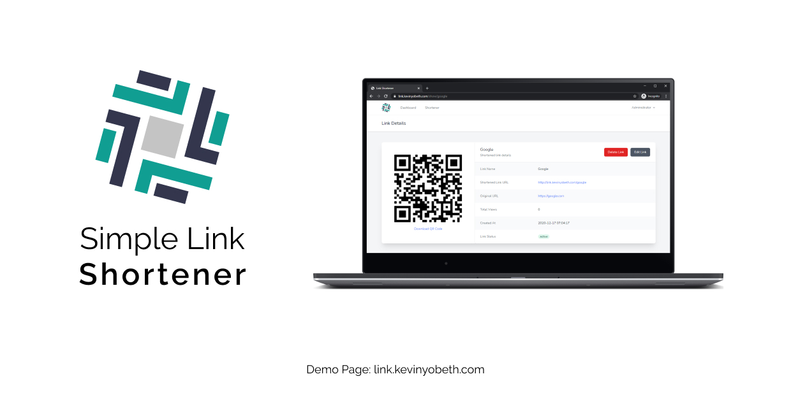
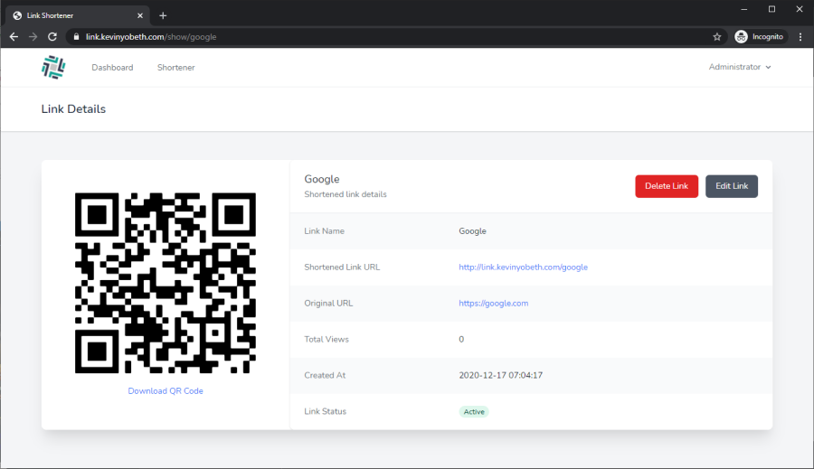
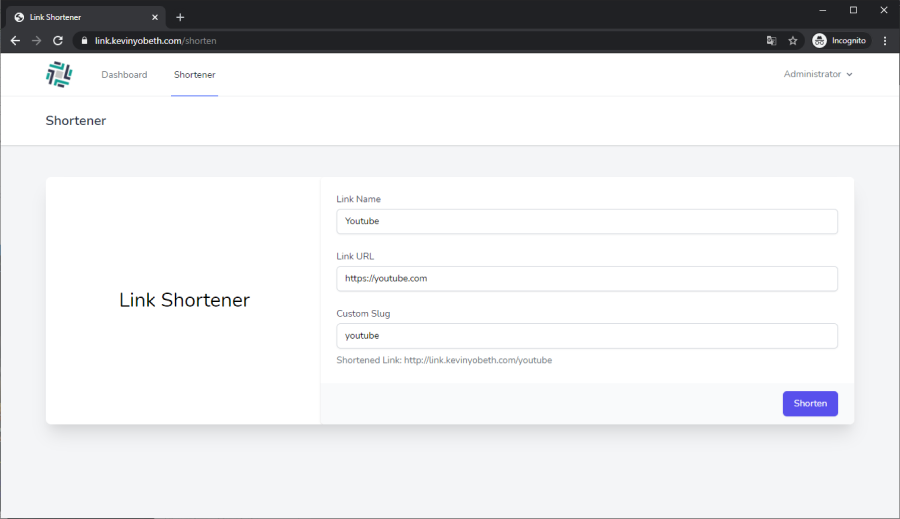
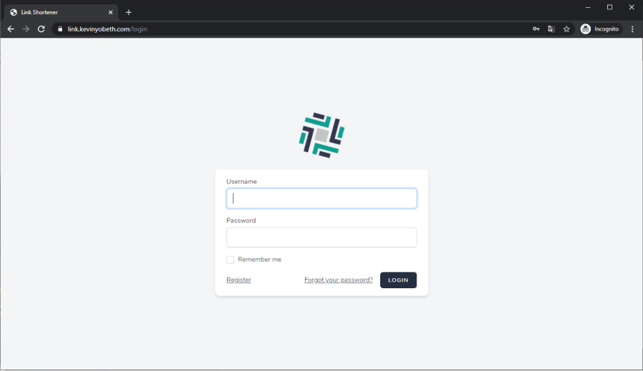

# Simple Link Shortener

A clean, simple looking link shortener built using Laravel 8 with Tailwind CSS. You can shorten your link and customize the slug, you can also download the QR code directly! Edit and maintain all of your links directly from the dashboard.

## Installation

-   Pull code from repo
    ```
    git pull https://github.com/KevinYobeth/Laravel-LinkShortener
    ```
-   Install dependencies
    ```
    composer install
    ```
-   Rename .env.example to .env (Windows)
    ```
    move .env.example .env
    ```
-   Generate key
    ```
    php artisan generate:key
    ```
-   Migrate and seed database
    ```
    php artisan migrate:fresh --seed
    ```
-   Run app
    ```
    php artisan serve
    ```

## App Preview

### Dashboard


### Link Detail



### Create Link



### Login



## Live Preview

You can view the live application [here](https://link.kevinyobeth.com/) or https://link.kevinyobeth.com

```
Default Credential

Username: administrator
Password: youShallNotPass!
```
